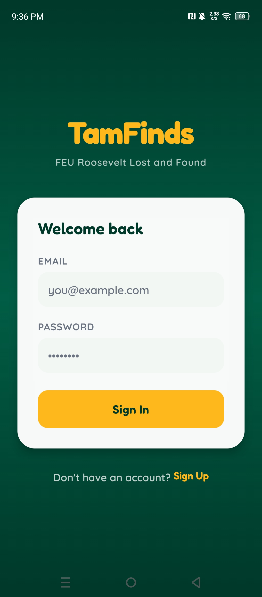
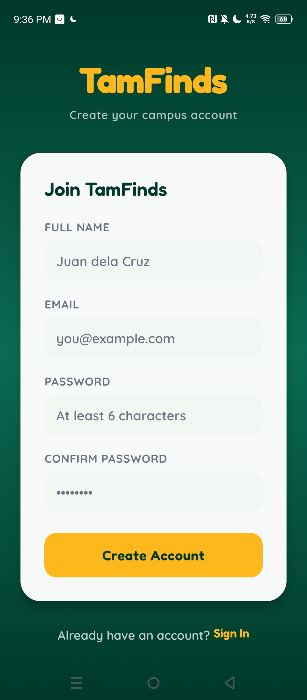
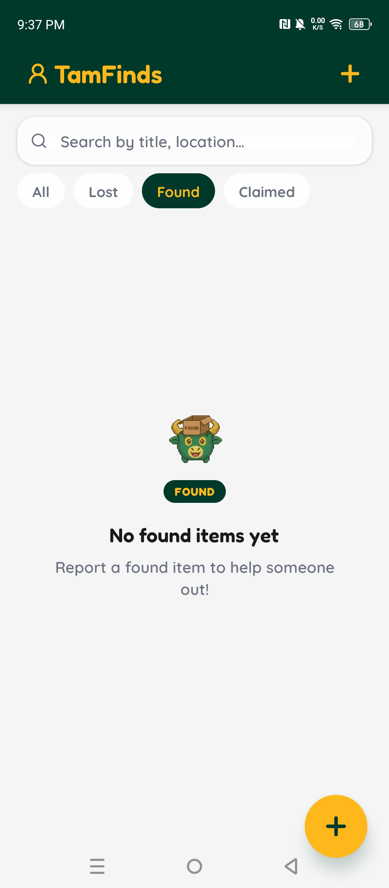
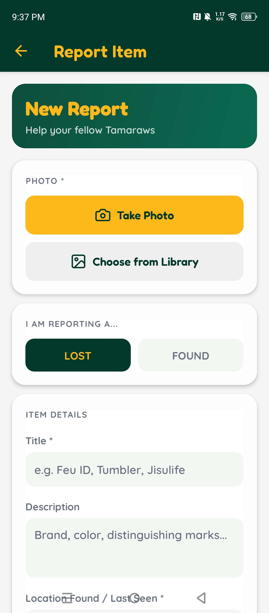
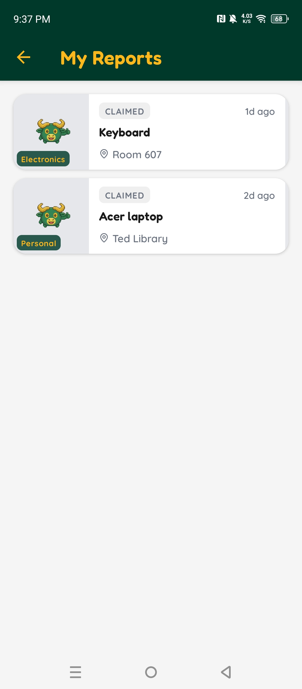

# TamFinds

Campus lost-and-found Mobile Application for the FEU Roosevelt community, built with Expo, React Native, and Firebase.


## Table of Contents

- [Overview](#overview)
- [Screenshots](#screenshots)
- [Features](#features)
- [Tech Stack](#tech-stack)
- [Architecture](#architecture)
- [Project Structure](#project-structure)
- [Getting Started](#getting-started)
- [Environment Variables](#environment-variables)
- [Available Scripts](#available-scripts)
- [Firebase Setup Checklist](#firebase-setup-checklist)
- [Data Model Summary](#data-model-summary)
- [Security Rules](#security-rules)
- [Current Status](#current-status)
- [Roadmap](#roadmap)
- [Contributing](#contributing)
- [License](#license)

## Overview

TamFinds provides a focused workflow for reporting and reclaiming lost items on campus:

- Report items with image upload and contextual details
- Browse a real-time feed of submitted entries
- Request claims for found items
- Approve pending claim requests as the original reporter

The app uses Firebase as a managed backend, with real-time data sync from Cloud Firestore and media storage in Cloud Storage.

## Screenshots

| Login | Sign Up |
| --- | --- |
|  |  |

| Home Feed | Report Item |
| --- | --- |
|  |  |

| My Reports |
| --- |
|  |

## Features

- Email/password authentication
- FEU domain verification flag (`@feuroosevelt.edu.ph`)
- Realtime item feed via Firestore subscriptions
- Item reporting with camera/gallery image support
- Image compression before upload
- Item detail screen with claim request actions
- Owner-side pending claim approvals
- My Reports screen for user-submitted items
- Reusable mascot-based UI components and shared design tokens

## Tech Stack

- Framework: Expo SDK 55 + React Native 0.83
- Language: TypeScript
- Styling: NativeWind v4 + Tailwind CSS v3
- Navigation: React Navigation (native stack)
- Backend: Firebase v12
    - Authentication
    - Cloud Firestore
    - Cloud Storage

## Architecture

- `src/api`: Firebase config and service modules (`items`, `users`, `claim requests`, `storage`)
- `src/hooks`: Feature hooks and auth/data subscriptions
- `src/screens`: Auth and app screen implementations
- `src/components`: Shared UI components (cards, skeletons, badges, mascot assets)
- `src/navigation`: Route definitions and root navigator
- `src/theme`: Color palette, typography, spacing/radius/shadow tokens
- `src/types`: Shared TypeScript types for users and items

## Project Structure

```text
tamfinds/
    app.json
    App.tsx
    firestore.rules
    storage.rules
    src/
        api/
        components/
        hooks/
        navigation/
        screens/
        theme/
        types/
```

## Getting Started

### Prerequisites

- Node.js 18+
- npm
- Expo CLI (optional, `npx expo ...` works)
- A Firebase project with Auth, Firestore, and Storage enabled

### Installation

```bash
npm install
```

### Run the App

```bash
npm run start
```

Platform-specific commands:

```bash
npm run android
npm run ios
npm run web
```

## Environment Variables

Create `.env.local` from `.env.example` and fill the values:

```env
EXPO_PUBLIC_FIREBASE_API_KEY=
EXPO_PUBLIC_FIREBASE_AUTH_DOMAIN=
EXPO_PUBLIC_FIREBASE_PROJECT_ID=
EXPO_PUBLIC_FIREBASE_STORAGE_BUCKET=
EXPO_PUBLIC_FIREBASE_MESSAGING_SENDER_ID=
EXPO_PUBLIC_FIREBASE_APP_ID=
```

Notes:

- All keys must start with `EXPO_PUBLIC_` to be available in the client bundle.
- Missing values will throw a startup error in `src/api/firebaseConfig.ts`.

## Available Scripts

From `package.json`:

- `npm run start` - Start Expo dev server
- `npm run android` - Start Expo for Android
- `npm run ios` - Start Expo for iOS
- `npm run web` - Start Expo for web

## Firebase Setup Checklist

- Enable Email/Password in Firebase Authentication
- Create Firestore database
- Enable Cloud Storage
- Deploy security rules

```bash
firebase deploy --only firestore:rules,storage
```

## Data Model Summary

### User Profile

- `uid: string`
- `email: string`
- `displayName: string`
- `isSchoolVerified: boolean`
- `createdAt: timestamp`

### Lost/Found Item

- `id: string`
- `title: string`
- `description: string`
- `imageUrl: string`
- `location: string`
- `category: 'Electronics' | 'IDs' | 'Books' | 'Personal'`
- `status: 'LOST' | 'FOUND' | 'CLAIMED'`
- `reporterId: string`
- `reportedAt: timestamp`
- `isAtSecurity: boolean`

Storage object path convention:

- `items/{uid}/{timestamp}_{filename}`

## Security Rules

- Firestore rules: `firestore.rules`
- Storage rules: `storage.rules`

Review and keep rules aligned with claim and ownership flows.

## Current Status

Project is in Phase 4 (Campus Identity), with core lost-and-found workflows complete and claim request features already integrated.

Reference docs:

- `docs/PROJECT_STATE.md`
- `docs/IMPLEMENTATION_STEPS.md`
- `docs/SCHEMA.md`

## Roadmap

- SVG-based mascot icon set
- Reject/cancel claim request actions
- Request history status chips
- Owner-side proof-of-ownership prompt before approval
- Notifications for new claim requests

## Contributing

1. Create a branch from `main`
2. Implement focused changes
3. Test your changes on at least one target platform
4. Open a pull request with a concise summary

## License

This project is licensed under the MIT License. See the [LICENSE](LICENSE) file for details.
